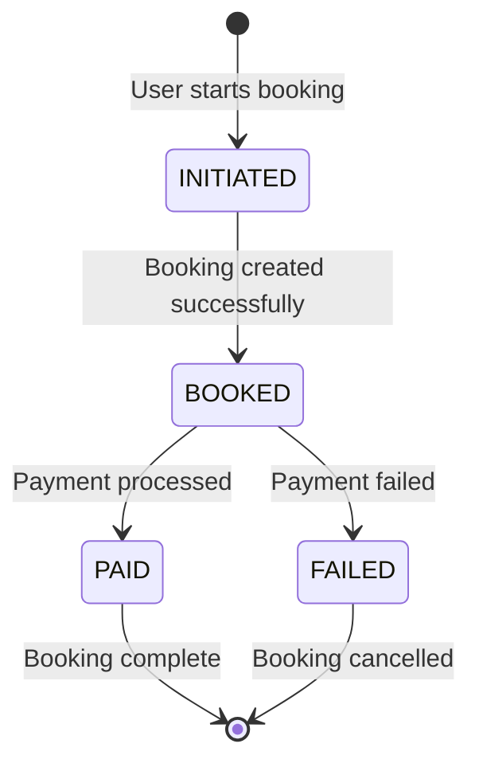

# ✈️ Airline Booking Service

> A comprehensive booking service for airline reservations with payment processing and idempotency handling.

[](https://nodejs.org/)
[](https://www.mysql.com/)
[](https://expressjs.com/)

## 📋 Table of Contents

- [Overview](#-overview)
- [Database Schema](#-database-schema)
- [API Documentation](#-api-documentation)
- [Features](#-features)
- [Tech Stack](#-tech-stack)

## 🌟 Overview

A robust airline booking service that handles flight reservations, seat management, and payment processing with built-in idempotency to prevent duplicate transactions.

### Key Highlights

- **💳 Payment Processing**: Secure payment handling with idempotency keys
- **🔒 Duplicate Prevention**: Idempotent APIs to prevent double bookings
- **💺 Seat Management**: Real-time seat allocation and availability
- **📊 Booking Lifecycle**: Complete booking status tracking
- **🗄️ Relational Database**: MySQL with proper data relationships

## 🗄️ Database Schema

### Booking Table


### Seats Table


## 📡 API Documentation

### Base URL
```
/api/v1
```

### Service Health Check

#### Get Service Info
```http
GET /api/v1/info
```

**Purpose**: Check if the service is running and fetch basic API information.

**Response (200 - OK):**
```json
{
  "success": true,
  "message": "API is up and running",
  "data": {
    "service": "Flight Booking API",
    "version": "1.0.0"
  },
  "error": {}
}
```

---

### Booking Operations

#### Create Booking
```http
POST /api/v1/bookings
```

**Purpose**: Create a booking for a given flight and user.

**Request Payload:**
```json
{
  "flightId": 1,
  "userId": 101,
  "noofSeats": 2
}
```

**Response (200 - OK):**
```json
{
  "success": true,
  "message": "Successfully completed the request",
  "data": {
    "id": 5001,
    "flightId": 1,
    "userId": 101,
    "noofSeats": 2,
    "status": "BOOKED",
    "totalCost": 200,
    "createdAt": "2025-08-16T12:45:00.000Z"
  },
  "error": {}
}
```

**Response (500 - Server Error):**
```json
{
  "success": false,
  "message": "Something went wrong",
  "data": {},
  "error": {
    "statusCode": 500,
    "explanation": "Could not process booking"
  }
}
```

---

### Payment Processing

#### Make Payment
```http
POST /api/v1/bookings/payments
```

**Required Headers:**
- `x-idempotency-key: <unique-key>` (Prevents duplicate payment requests)

**Purpose**: Process a payment for a booking.

**Request Payload:**
```json
{
  "totalCost": 200,
  "userId": 101,
  "bookingId": 5001
}
```

**Response (200 - OK):**
```json
{
  "success": true,
  "message": "Payment successful",
  "data": {
    "paymentId": 9001,
    "bookingId": 5001,
    "amount": 200,
    "status": "PAID",
    "createdAt": "2025-08-16T12:50:00.000Z"
  },
  "error": {}
}
```

**Response (400 - Missing Idempotency Key):**
```json
{
  "message": "Idempotency key is required"
}
```

**Response (400 - Duplicate Request):**
```json
{
  "message": "Cant process the same request twice"
}
```

## ✨ Features

### Booking Management
- **Flight Reservations**: Create bookings for specific flights and users
- **Seat Allocation**: Dynamic seat management with availability tracking
- **Cost Calculation**: Automatic total cost computation based on seat count
- **Status Tracking**: Complete booking lifecycle management

### Payment System
- **Idempotency Keys**: Prevent duplicate payment processing
- **Secure Transactions**: Safe payment handling with proper validation
- **Payment Tracking**: Complete payment history and status management
- **Error Handling**: Comprehensive error responses for payment failures

### Data Integrity
- **Relational Schema**: Proper foreign key relationships between bookings and seats
- **Transaction Safety**: Database transactions for booking operations
- **Validation**: Input validation for all booking and payment requests

### API Design
- **Consistent Responses**: Standardized response format across all endpoints
- **Error Handling**: Proper HTTP status codes and error messages
- **RESTful Design**: Clean REST API architecture

## 🛠️ Tech Stack

**Backend Framework:**
- Node.js with Express.js
- RESTful API architecture

**Database:**
- MySQL with relational schema design
- Foreign key constraints for data integrity

**Features:**
- Idempotency key validation
- Transaction-based operations
- Comprehensive error handling
- Request validation middleware

## 📊 Booking Lifecycle



## 🔒 Idempotency Handling

The payment system implements idempotency to ensure safe payment processing:

- **Required Header**: `x-idempotency-key` must be included in payment requests
- **Duplicate Prevention**: Same idempotency key cannot be reused
- **Safe Retries**: Clients can safely retry failed requests with the same key
- **Automatic Validation**: System automatically validates and rejects duplicate keys

## 📝 Response Format

All API responses follow a consistent structure:

```json
{
  "success": boolean,
  "message": string,
  "data": object | {},
  "error": object | {}
}
```

**Success Response**: `success: true` with relevant data
**Error Response**: `success: false` with error details

---

**Built for reliable airline booking operations with payment safety**
